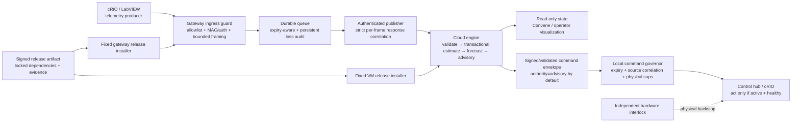

# RECLAIM Integrated Remediation Architecture and Working-Session Plan

> **Closure note 2026-08-27:** this proposed plan is retained as design evidence.
> The final architecture uses the Windows 10 desktop for live telemetry and the
> MacBook only for loopback scenarios; the root README is authoritative.

**Date:** 2026-08-16
**Status:** Proposed implementation architecture — no runtime changes made by this document
**Purpose:** Turn the predictive-engine, gateway, and CI/CD red-team findings into one safe delivery program.

## 1. Outcome and non-negotiable constraints

The outcome is a reliable live digital twin that can be updated frequently without changing the meaning of telemetry, silently corrupting state, or turning a deployment/release failure into a control failure.

The system starts and remains in **advisory authority**. No software change in this plan authorizes autonomous microwave control. `active` command authority is a separate future release gate, not an implementation side effect.

Non-negotiable constraints:

1. The physical hardware interlock remains independent and authoritative.
2. A missing, stale, malformed, delayed, or untrusted signal can never make a command actionable.
3. A failed ingest must leave estimator, lifecycle, queue, and identity state exactly as before the failed frame.
4. The forecast must propagate the same enabled physics as the estimator, including reaction heat and charge-mass evolution.
5. Production hosts run reviewed release installers, not repository-defined CI jobs or arbitrary remote shells.
6. A deployment is forbidden during an active batch until a validated state-handoff design exists.
7. Every deployed binary is traceable to a signed artifact digest, source commit, dependency lock, test evidence, and rollback target.

## 2. Source documents and finding IDs

This plan is the integration point for:

- [Predictive engine red-team assessment](../PREDICTIVE_ENGINE_RED_TEAM_ASSESSMENT.md): `RT-01` through `RT-08`
- [Predictive-engine remediation and command-authority plan](RECLAIM_Predictive_Engine_RedTeam_Remediation.md)
- [Live telemetry architecture](RECLAIM_Live_Telemetry_Architecture.md)
- [CI/CD implementation baseline](RECLAIM_CI_CD_IMPLEMENTATION_BASELINE.md)

Superseded gateway and CI/CD handoff assessments were removed at project closure
and remain available through Git history only.

Any implementation PR must cite the finding IDs it closes and add the named regression evidence in §10.

## 3. Target architecture



### 3.1 Plane separation

| Plane | Responsibility | Must not do |
|---|---|---|
| Telemetry plane | Receive, authenticate, validate, queue, order, and deliver frames | Grant command authority or execute arbitrary management actions |
| Model plane | Estimate state, forecast, calculate residuals, and publish an explainable advisory | Treat unvalidated inputs as measurements or mutate state on failed processing |
| Command plane | Carry an explicitly scoped, expiring intent through a local safety governor | Use cloud reachability, visualization state, or raw measured power as authority |
| Safety plane | Enforce independent physical limits/interlock | Depend on the twin, gateway, CI system, or network |
| Management/release plane | Produce and promote signed, tested artifacts | Share a general CI runner or remote shell with production control hosts |

### 3.2 Authority model

`authority=advisory` is the only permitted production setting during this program. The engine may calculate and publish intended action, but it must set `cmd_actionable=false`.

An eventual `authority=active` setting requires every gate in §12, including independent actuator-side enforcement. It cannot be flipped by a cloud response, a CI variable, an HMI preference, or a deployment script.

## 4. Core runtime architecture changes

### 4.1 Gateway ingress guard

Replace “trusted plaintext LAN” as the only control with an explicit ingress boundary.

1. Bind the receiver only to the dedicated cRIO network interface.
2. Enforce host-firewall remote-address allowlisting for the cRIO address.
3. Require one of: mutually authenticated transport, or a per-frame MAC with replay protection managed by the cRIO/control team. If neither is feasible immediately, classify the link as non-security-grade and keep authority advisory.
4. Limit connection count, connection lifetime, idle time, frame bytes, buffered bytes, JSON nesting/value type, and parsing time.
5. Require a JSON object and an allowlisted raw schema before enqueueing. Preserve a raw audit copy separately only if operationally required.
6. Reject non-finite/range-invalid data at the earliest possible boundary. Count and surface every rejection.

**Design decision:** malformed inputs are rejected per frame; they must not kill the receiver thread, restart the service, or consume unbounded memory.

### 4.2 Queue and outage recovery

The queue remains durable, but it must become freshness-aware.

1. Give every queued record a local receive timestamp and source timestamp.
2. Before sending, locally expire frames that cannot meet the cloud freshness window; move them to persistent dead-letter/audit storage with an explicit reason.
3. During backlog recovery, publish only usable current data according to a documented policy—normally retain the newest valid sample per chamber/stream while separately retaining older data for audit.
4. Persist drop/dead-letter counters, first/last loss time, and highest lost sequence. Expose a `DATA_NOT_LIVE`/`BACKLOGGED` status locally and upstream.
5. Treat disk-space low, queue overflow, and delivery outage as operational alarms. They do not silently degrade to normal forwarding.

### 4.3 Transactional cloud ingestion and state

Refactor one accepted frame into two stages:

1. **Validate:** fully normalize, validate all chamber inputs, calculate time/continuity classification, and reject malformed values before any mutable model operation.
2. **Prepare:** apply the frame to isolated candidate copies of both chamber engines, ingest identity, local time, lifecycle, and output state.
3. **Commit:** atomically swap candidates into live state and persist identity only after all calculations and publication preparation succeed.
4. **Fail:** discard candidates; preserve the pre-frame state; return a retryable error only when retry is truly safe.

Initial deployments occur only in a safe/idle maintenance state. Process-resident UKF/lifecycle state is not relied upon for hot upgrade continuity until a separately tested snapshot/version/migration design exists.

### 4.4 Unified estimator and forecaster state

The estimator and forecaster must use one complete state definition:

```text
s = [T_bed, T_wall, beta, charge_mass]
inputs = [P_fwd, P_refl, environment, authorized_setpoint]
terms = P_abs + q_rxn - U_bw(T_bed - T_wall) / C_bed_eff(charge_mass, T)
```

Implementation rules:

- Charge mass is a physical state propagated by both live step and forward forecast.
- All enabled `q_rxn` terms are included in both derivatives.
- Latent heat, ignition coupling, capacity changes, and configured chemical terms share the same constitutive functions; do not maintain a hand-copied “fast” model without parity tests.
- The forecast either evaluates a validated future power schedule or explicitly reports a bounded held-input assumption.
- Forecast uncertainty is presented as an **ensemble-risk indicator** until a statistically calibrated probability model is implemented and validated. Do not label it `p_event` or use `> 0.5` as a probability threshold in that interim state.

### 4.5 Continuity and degraded mode

Define a maximum source-time continuity interval. A gap longer than that interval is not merely clamped.

When continuity fails:

1. Set model/command health to `degraded`.
2. Suppress normal lead-time forecast and rate-derived escalation.
3. Increase uncertainty or reinitialize from validated measurements using a documented re-acquisition procedure.
4. Require a configured number of consecutive healthy frames before leaving degraded mode.
5. Record source gap duration and recovery evidence in state/events.

### 4.6 Command envelope and local governor

The engine and gateway return an explicit command envelope rather than an unstructured dictionary.

| Field | Requirement |
|---|---|
| `schema_version` | Versioned command contract, e.g. `reclaim.command.v1` |
| `command_id` | Unique ID for audit/idempotency |
| `authority` | `advisory` or `active`; static deployment policy, default `advisory` |
| `actionable` | True only in active authority and healthy state |
| `source_run_id`, `source_seq`, `source_ts` | Bind command to exact accepted telemetry state |
| `issued_at`, `valid_until` | Short validity deadline; actuator fails closed on expiry |
| `chamber`, `mode`, `power_setpoint_W` | Bounded physical intent, derived from authorized demand—not measured power |
| `health`, `reason` | Machine-readable failure/degraded condition and human explanation |
| `artifact_version` | Running engine release for traceability |

The local command governor verifies schema, timestamps, source correlation, freshness, health, authority, physical caps, and replay/idempotency before exposing any command to the actuator. It defaults to safe behavior on every failure. The hardware interlock remains outside this contract.

## 5. Release and CI/CD architecture

### 5.1 Repository and trust baseline

1. Initialize a private Git repository from a reviewed baseline; do not use the ZIP as deployment lineage.
2. Protect `main` and release tags. Require reviews and CI checks.
3. Add CODEOWNERS/required review for workflow files, deployment tooling, predictive/control logic, gateway ingress/queue code, and safety thresholds.
4. Pin GitHub Actions by full commit SHA; use least-privilege workflow permissions; do not expose production credentials to pull-request CI.

### 5.2 Reproducible release candidate

CI produces a signed release candidate from a protected `main` commit:

```text
source commit
  → locked dependency resolution + wheel set
  → unit / integration / fault / regression tests
  → SBOM + test reports + seeds
  → immutable archive
  → signed manifest bound to artifact digest
```

The manifest contains source commit/tree digest, artifact SHA-256, lockfile/wheel digest, supported Python/platform, state/queue/command schema compatibility, test report IDs, fault seed IDs, release notes, and previous compatible rollback version.

Use exact hash-locked dependencies and build/install from the audited wheel set. Production does not resolve `>=` requirements from public indexes during deployment.

### 5.3 Production promotion

Production hosts pull an approved artifact by digest through a fixed release installer. They do not host a general GitHub Actions runner and do not execute repository-provided workflow code.

The installer:

1. verifies manifest signature, artifact digest, and target compatibility;
2. creates an immutable release directory and locked virtual environment;
3. runs local artifact smoke tests;
4. verifies the maintenance gate;
5. atomically switches the stable release root used by the actual service/task;
6. restarts and verifies the intended executable/version, local health, state/queue compatibility, and no unexpected writer;
7. writes a non-secret deployment receipt; and
8. restores the recorded previous release on failure, then verifies recovery.

Standardize runtime paths before implementation:

- Windows Server 2025 VM: WinSW service working directory and executable resolve
  through `C:\ProgramData\RECLAIM\current`.
- Gateway: Scheduled Task executable and working directory resolve through `C:\RECLAIM\current`.

Release directories never contain secrets, live database files, logs, or mutable state.

### 5.4 Deployment maintenance gate

Before a release switch, require:

- sequencer in a documented safe/idle state;
- `active_chamber=NONE` and power removal confirmed by the independent control system;
- no pending actionable command;
- queue depth/loss status within defined thresholds;
- cloud/gateway health acceptable;
- a named approver, artifact digest, rollback release, and maintenance-window record.

If these cannot be satisfied, deploy a non-writing shadow candidate instead of cutting over.

## 6. Delivery phases

The phases are deliberately ordered so CI never certifies unsafe behavior and CD never becomes the first real test of a new runtime path.

| Phase | Goal | Depends on | Exit gate |
|---|---|---|---|
| 0. Governance and baseline | Establish source/release ownership and advisory-only policy | None | Protected repo, owners, active-authority hard-disabled |
| 1. Engine integrity | Transactional ingestion and finite/range validation | 0 | RT-03/RT-05 regressions pass; advisory release can be trusted not to corrupt state |
| 2. Forecast and continuity fidelity | Align forecaster with plant and implement degraded mode | 1 | RT-01/04/06/08 regression/parity suite passes |
| 3. Gateway boundary hardening | Bound/authenticate ingress; reliable queue/recovery; strict cloud ACK | 0, 1 | GW-03/04/05/06/07/08/10 suite passes |
| 4. Command contract and local safety governor | Explicit advisory envelope, expiry, health, source binding | 1, 2, 3 | No command can be actionable in advisory; fail-closed behavior demonstrated |
| 5. Reproducible CI | Locks, tests, signed candidates, reporting | 1–3 | CI runs all named safety regressions without production access |
| 6. Controlled CD | Fixed VM/gateway installers, state compatibility, rollback | 5 | CD-01–10 evidence; maintenance-gated upgrade/rollback drill passes |
| 7. Shadow pilot and active-authority decision | Compare candidate vs live advisory; decide whether active control is justified | 2–6 | Required operational evidence and independent safety review; explicit human go/no-go |

Phases 1 and 3 may be implemented in parallel after Phase 0, but Phase 4 and all control-facing deployment work wait for both.

## 7. Working-session sequence

### Session A — Lock decisions and build the test harness

1. Confirm authority remains advisory for this milestone.
2. Choose the initial deployment platforms and supported Python versions.
3. Define physical/range envelopes with controls/thermal owners.
4. Define telemetry, command, state, and queue compatibility versioning.
5. Create a test inventory mapping every RT/GW/CD finding to a failing regression test before changing runtime behavior.
6. Initialize Git governance and a development/CI environment with lock-file tooling.

**Deliverables:** decision record, test matrix, repository policy, initial CI skeleton that runs only local checks.

### Session B — Engine integrity and model work

1. Implement candidate-state/commit semantics for a dual-chamber frame.
2. Add validation before mutation; capture rejection reasons.
3. Centralize physical derivative/mass functions; refactor forecast to use them.
4. Implement continuity/degraded state and non-probabilistic risk labeling.
5. Run synthetic, replay, and fault cases with deterministic seeds.

**Deliverables:** Phase 1–2 code, passing regressions, model-parity report, updated state contract.

### Session C — Gateway hardening and command contract

1. Implement bounded ingress/schema validation and receiver fault isolation.
2. Implement freshness-aware queue recovery/persistent loss audit.
3. Require strict cloud ACK/response correlation and secure live transport configuration.
4. Implement versioned command envelope and local advisory verifier/governor.
5. Exercise timeout, malformed input, outage, stale command, and recovery tests.

**Deliverables:** Phase 3–4 code, command contract, operational alarms, end-to-end advisory proof.

### Session D — Build and release machinery

1. Add locks/wheels/SBOM/manifest/signing to CI.
2. Add PR, main, nightly fault, and release-candidate workflows.
3. Update service/task templates to stable release roots.
4. Implement fixed VM and gateway release installers and receipts.
5. Execute upgrade and rollback drills in non-production with persisted-state compatibility checks.

**Deliverables:** Phase 5–6 CI/CD, audit evidence, rollback evidence, revised runbooks.

### Session E — Shadow operation and decision

1. Deploy advisory-only candidate side by side in an isolated namespace/port.
2. Compare state, forecast, integrity events, and command health against the approved release using live or representative replay data.
3. Review false positives/negatives, gaps, recoveries, and operator usability.
4. Decide whether to remain advisory or start a separately governed active-authority program.

**Deliverables:** shadow-pilot report and explicit go/no-go record.

## 8. Change classification for frequent fixes

| Change type | Examples | Minimum evidence before promotion |
|---|---|---|
| Documentation only | runbook, comments, mappings | PR review and docs check; no runtime deployment needed |
| Observability only | logs, metrics, non-command display | Unit/integration test and normal release verification |
| Telemetry/gateway | framing, queue, schema, normalization | Gateway fault suite, VM compatibility review, shadow validation |
| Model/advisory | UKF, forecast, residual, thresholds | Model parity + replay/fault suite + operator review of shadow outputs |
| Command/safety | authority, command schema, limits, expiry | Independent review, full release-candidate suite, maintenance window, rollback drill |
| Release tooling | workflow, installer, service/task paths, signing | Security review, artifact verification test, non-production upgrade/rollback drill |

No “urgent fix” bypasses the tests or the maintenance gate. Urgency changes scheduling and approval attention, not safety proof.

## 9. Required interfaces and compatibility policy

| Interface | Versioning rule | Compatibility rule |
|---|---|---|
| cRIO → gateway telemetry | Explicit schema version | Additive fields allowed only after validation; breaking field/unit change requires coordinated rollout |
| Gateway → engine ingest | `reclaim.telemetry.v1` until intentionally versioned | Cloud accepts supported versions explicitly; no silent legacy fallback in production |
| Engine → state/Convene | State schema version and producer artifact version | Candidate/shadow has a distinct namespace; exactly one production writer |
| Engine → gateway command | New `reclaim.command.v1` envelope | Unknown/missing/expired version is non-actionable |
| Persistent queue/identity | Version in manifest and on disk | Installer blocks incompatible upgrade/rollback without migration/restore plan |
| Release manifest | Signed schema | Host accepts only supported signer, target, and format |

## 10. Verification architecture

Every item below is a release-blocking automated test once implemented.

| Finding group | Test proof |
|---|---|
| RT-01 / RT-08 | Live and forecast derivatives match across mass flow, reaction, ignition, latent heat, and representative schedules |
| RT-03 / RT-05 | Failure after first chamber preserves byte-equivalent prior state; non-finite/range-invalid data is rejected before mutation |
| RT-04 | Risk output cannot be consumed as a calibrated probability without calibration evidence |
| RT-06 | Continuity gap produces degraded state; normal forecast/action remains suppressed until recovery criteria |
| RT-02 / RT-07 | Advisory commands are non-actionable; active envelope source/expiry/cap checks fail closed |
| GW-03 / GW-04 | Arrays, scalars, malformed JSON, oversized/no-newline streams, and competing clients do not kill or wedge receiver |
| GW-05 / GW-07 | Live config rejects insecure transport; malformed/mismatched 2xx cannot dequeue payload |
| GW-06 / GW-10 | Long outage produces audited local expiry/loss and recovers to current frames without hidden backlog behavior |
| CD-01 / CD-02 | Production installer accepts only signed digest-bound candidate; CI has no production connectivity/credentials |
| CD-03 / CD-07 | Upgrade/rollback runs the expected executable and enforces queue/state compatibility |
| CD-06 / CD-10 | Active-batch deployment is denied; candidate is isolated from production writer/command paths |

Test layers:

1. unit tests for deterministic functions and contracts;
2. process-local integration tests for gateway → cloud engine;
3. seeded fault campaigns for ordering, loss, restart, malformed input, and recovery;
4. release-candidate tests against the packaged artifact and locked dependencies;
5. non-production upgrade/rollback drills; and
6. advisory-only shadow comparison before a live cutover.

## 11. Decisions required before implementation begins

These are explicit human decisions; do not infer them in code.

1. **Command scope:** Is the next milestone strictly advisory, or is the team committing to develop an active controller after shadow evidence? This plan assumes strictly advisory.
2. **cRIO security capability:** Can the cRIO implement a message MAC/mTLS-equivalent, or is network isolation the only attainable control for now?
3. **Physical envelopes:** What are the approved limits for temperature, pressure, power, reflected-power ratio, sensor disagreement, command deadline, and allowed continuity gap?
4. **Release signing trust root:** Which team identity/key system signs release manifests, and where is the verifier trust policy maintained on VM/gateway?
5. **Gateway remote management:** Will the SYSTEM-level remote-command agent be removed/relocated before any control-connected deployment?
6. **Operational maintenance authority:** Who can declare idle/safe maintenance state and approve a release/rollback?

## 12. Final release gates

### Advisory production gate

Advisory deployment is permitted only when Phases 0–6 are complete for the changed subsystems, Workstream A from the predictive remediation plan is closed, and the following are true:

- commands are provably non-actionable;
- engine and gateway integrity regressions pass;
- release is signed, reproducible, and rollback-tested;
- gateway/VM deployment is maintenance-gated;
- there is one production state writer and no candidate can command/control;
- health, freshness, queue loss, and artifact version are observable.

### Active command-authority gate

Active authority is prohibited until all advisory requirements plus the following are independently evidenced:

- forecast/model parity across production configurations;
- calibrated or correctly non-probabilistic risk decision semantics;
- gateway ingress and command governor hardening;
- actuator-side fail-closed expiry/source/cap enforcement;
- continuity/degraded-mode recovery behavior;
- full fault-injection and shadow-pilot evidence;
- independent review proving hardware interlock independence; and
- an explicit written approval to enable `authority=active`.

## 13. First implementation task

Begin with **Phase 0 + the Phase 1 test harness**: establish the private protected repository, set advisory-only configuration policy, add a locked development environment, and write failing regression tests for transactional stepping and non-finite/range validation. This produces an immediate, auditable foundation for the next working session without touching live hosts or changing command authority.
